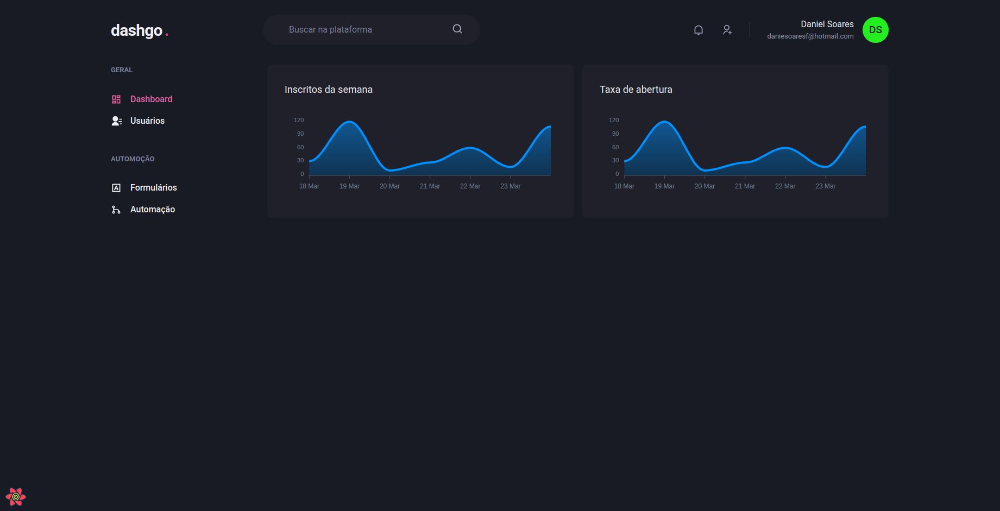

<h1 align="center">
  💻 Ignite - Data fetching e cache local
</h1>

<h4 align="center"><a href="https://lostcode-blog-ten-liard.vercel.app/">Clique para visitar o projeto</a></h4>

## 📚 Descrição

Neste projeto, foi desenvolvida uma interface de um painel administrativo que engloba fluxo de autenticação, dashboard, listagem e cadastro, utilizando Chakra UI no Next.js. Além disso, o React Query foi utilizado para aprimorar a experiência do usuário, criando uma camada de cache de dados entre o front-end e o back-end.

---

## 💼 Tecnologias utilizadas

Para o desenvolvimento deste site utilizei as seguintes tecnologias:

- HTML;
- CSS;
- Typescript;
- React;
- Next.js;
- Chakra UI;
- React Query;

---

<h2>Autor</h2>

<table>
  <tr>
    <td align="center">
      <a href="https://github.com/daniel-soaress">
         
        
          <b>Daniel Soares</b>
        
      </a>
    </td>
  </tr>
</table>
